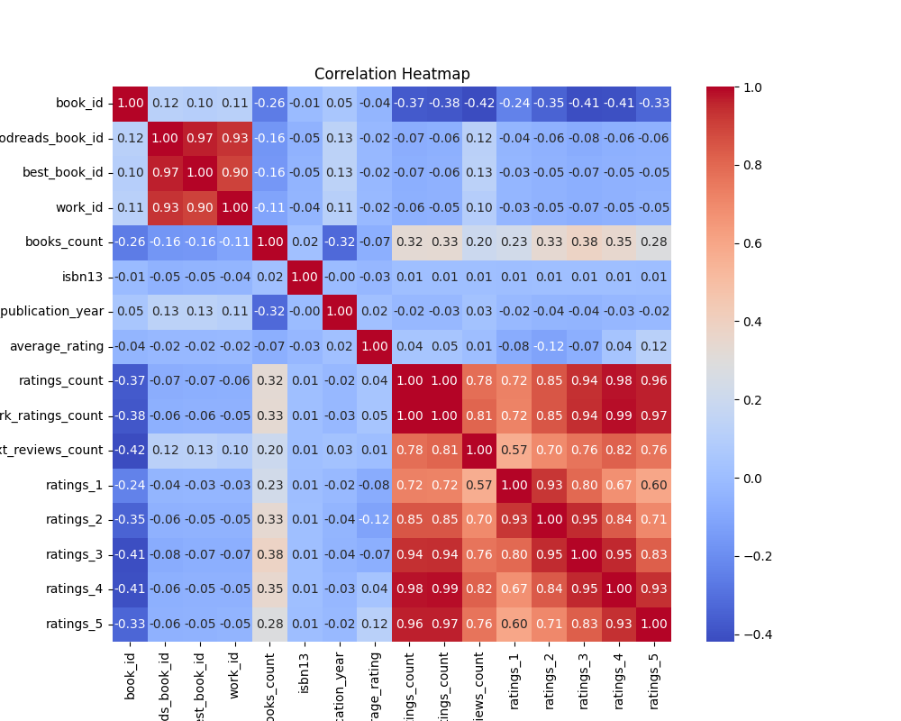

# Analysis Results

## Insights from Dataset

Here is an analysis of the provided dataset based on the summary statistics and column descriptions:

### General Overview
- **Total Number of Books**: The dataset consists of **10,000 books**, as indicated by the count of several columns.
- **Authors**: There are **4,664 unique authors** contributing to the dataset.
- **Language**: The primary language code appears to be English (eng), which is common in literature datasets.
- **Publication Year**: Books span various publication years, with an average publication year of approximately **1982**, showing a potential mix of classic and contemporary literature.

### Ratings
- **Average Rating**: The average rating across all books is **4.00**, suggesting that most books are relatively well-received, as it skews higher on the rating scale (1 to 5).
- **Ratings Distribution**:
  - **Total Ratings Count**: The average book has about **54,000 ratings**, indicating high engagement. The maximum number of ratings received by a single book is around **4.7 million**.
  - **Rating Breakdown**:
    - Ratings count per star rating (1-5) shows substantial differences:
      - **1 Star**: Average of **2,919** ratings.
      - **2 Stars**: Average of **1,345** ratings.
      - **3 Stars**: Average of **3,110** ratings.
      - **4 Stars**: Average of **11,475** ratings.
      - **5 Stars**: Average of **19,965** ratings.
    - The high number of 5-star ratings relative to lower ratings suggests that users typically rate books positively.

### Key Insights
1. **Popular Authors**: The dataset indicates Stephen King is among the most frequent authors, with **60 books** represented. This points to a popular author dominating the dataset, indicating a potential market influence or reader preference.
2. **Publication Trends**: The range of publication years (the earliest book was published in **-1750** and as recent as **2017**) suggests a wide historical arc, but the median year of **2004** points toward a concentration of newer titles.
3. **Books Count**: The average number of books per entry is approximately **75**, indicating that many books are part of series or collections.
4. **Engagement Levels**: The high average ratings and significant engagement via total ratings counted imply that the dataset consists of popular and well-rated books, which could be indicative of a curated selection favoring quality literature.

### Recommendations for Further Analysis
- **Correlation Analysis**: Investigate if there are any correlations between the year of publication, author popularity, and ratings.
- **Genre Breakdown**: If genre data were available, categorizing the works could yield insights around which types of books perform better.
- **Review Sentiment Analysis**: Analyzing text reviews could uncover thematic trends in reader feedback and preferences. 

### Visualization Suggestions
- **Histogram**: Visualize the distribution of average ratings.
- **Line Chart**: Display trends in publication years contrasted with average ratings over time.
- **Bar Plot**: Showcase the number of books per author, highlighting the most prolific authors.

Overall, this dataset offers significant opportunities for insights into the world of literature, focusing on reader engagement and historical context.

