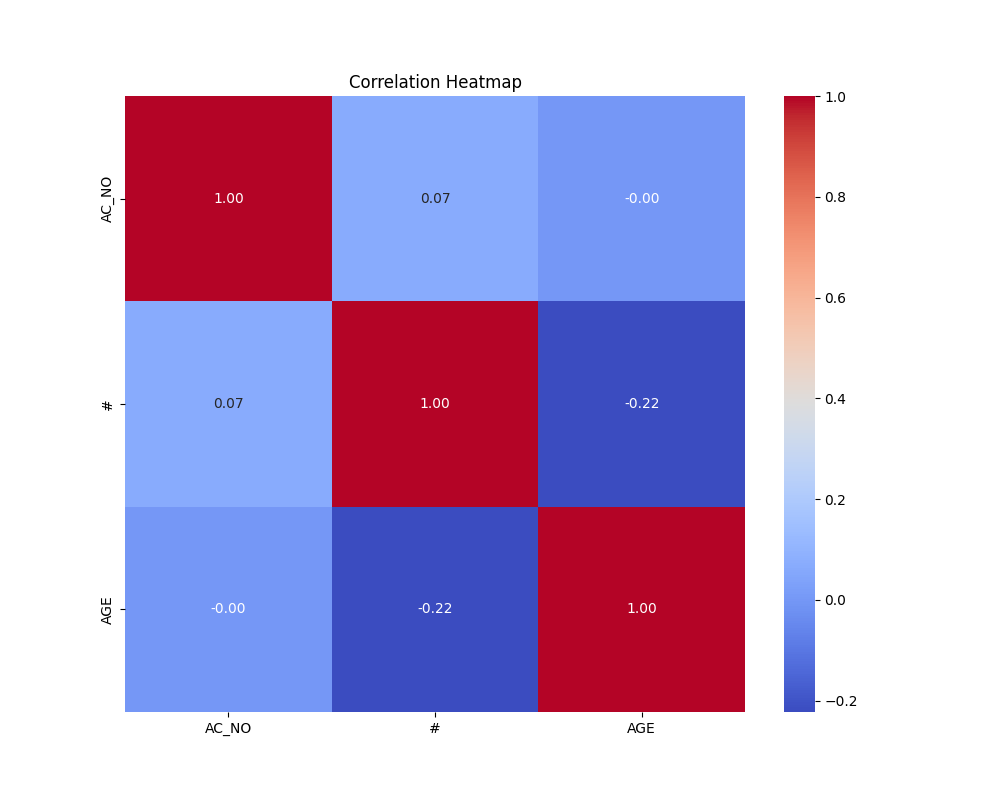

# Analysis Results

## Insights from Dataset

Based on the summary statistics you provided for the dataset, here is a detailed analysis and insights:

### Overview:
The dataset contains 130 records of electoral data, with variables such as state name (`ST_NAME`), year (`YEAR`), assembly constituency number (`AC_NO`), assembly constituency name (`AC_NAME`), assembly constituency type (`AC_TYPE`), and details about candidates including their name, sex, age, category, party affiliation, and votes received. 

### Main Insights:

1. **State Distribution:**
   - There are 6 unique states, with the majority of records coming from Bihar (69 occurrences). This indicates a significant focus on Bihar in the dataset.
   - Other states might be contributing fewer instances or variations.

2. **Time Frame:**
   - The entries span from the year indicated (e.g., feb2005). The temporal distribution within this year could impact voting trends and electoral behavior.

3. **Constituency Details:**
   - There are a total of 91 unique assembly constituency names, with the most frequent being "BISHRAMPUR" (6 occurrences). This suggests that some constituencies might have been the focus in multiple elections.

4. **Candidate Characteristics:**
   - Gender Distribution: 
     - The candidate pool shows a strong male dominance, with 125 male candidates compared to only 5 females. This is a critical insight as it reflects gender representation in electoral candidacy.
   - Age:
     - The candidates' ages have an average of approximately 41.86 years with a minimum of 25 years and a maximum of 69 years. The age distribution seems to be fairly diverse but heavily skewed toward middle-aged candidates.
   - Age percentiles indicate that 75% of candidates are aged 48 or younger, while 25% are older than 48. 

5. **Party Representation:**
   - There are 29 unique political parties in the dataset, with the Independent (IND) party receiving the highest frequency (50 occurrences).
   - This indicates a significant presence of independent candidates in the elections. The presence of multiple parties highlights a diverse political landscape.

6. **Voting Data Overview:**
   - Voting data is somewhat incomplete as there are 4 records with missing vote counts (`VOTES`), denoted by "-".
   - Analyzing the vote counts (while excluding those with missing data) can give insights into candidates' electoral performance and public support.

7. **AC_Type Deduction:**
   - The `AC_TYPE` column has 3 unique values, but these are not defined here. If these indicate reserved seats, general, or other classifications, their breakdown could reveal how many opportunities exist for categories such as women or scheduled castes.

### Recommendations for Further Analysis:

1. **Candidate Performance:**
   - Analyze the relationship between candidate characteristics (like age, gender, party) and votes received to identify which factors correlate with higher voter support.

2. **Regional Variations:**
   - It would be beneficial to explore how voting patterns may differ across the identified states, particularly in Bihar versus others.

3. **Party System:**
   - Further classification and breakdown of votes by party could help assess electoral competition and party strength in various constituencies.

4. **Gender Representation:**
   - Advocating for more representation and examining the barriers that might be influencing the gender disparity in candidacy could be beneficial.

5. **Electoral Changes Over Time:**
   - Conduct a time-series analysis if data across multiple years is available to observe trends in candidate demographics, party strength, and voter turnout.

By diving deeper into these insights, stakeholders can better understand electoral dynamics, identify opportunities for engagement, and assess the representation of different demographics in political processes.

